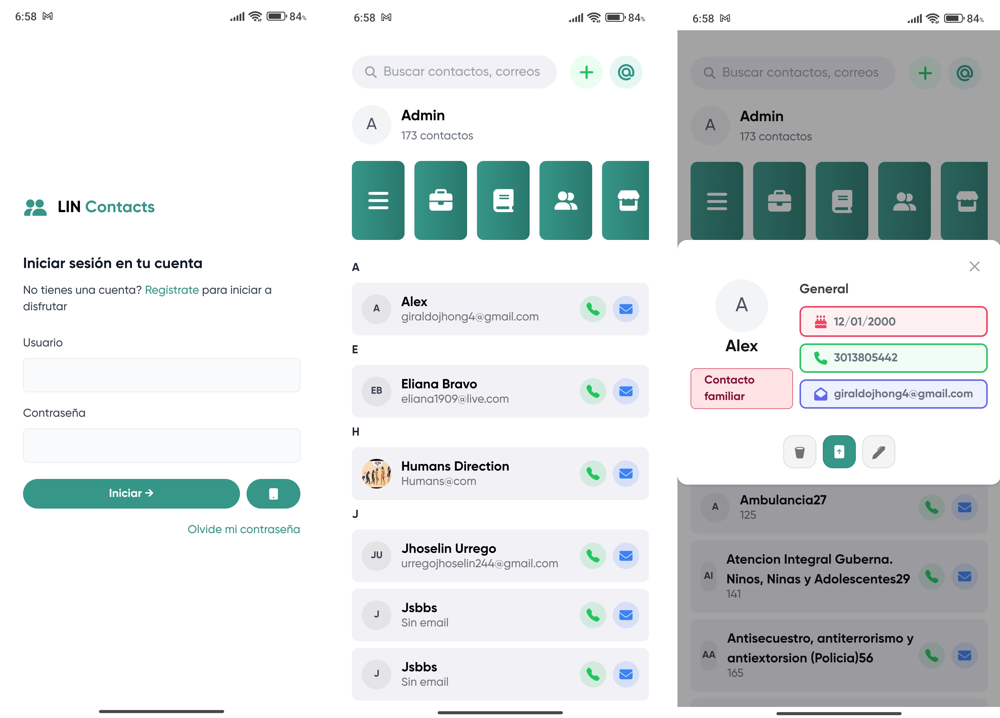
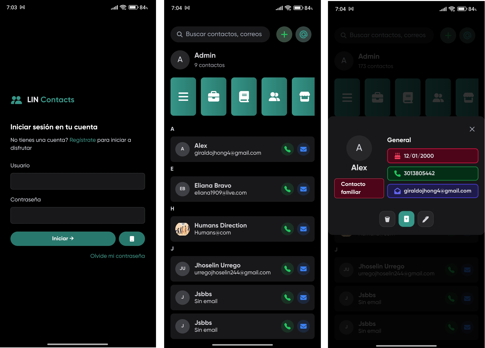

  

    
  

  
LIN Contacts es una aplicación nativa para Windows y Android construida en Maui que facilita la gestión de contactos.

## Características Principales

- **Gestión de contactos**: Crea y administra tus contactos personales o profesionales.
- **Sincronización**: Los contactos se sincronizan con tu cuenta LIN y están disponibles en cualquier dispositivo.

#### Modo claro

#### Modo oscuro
